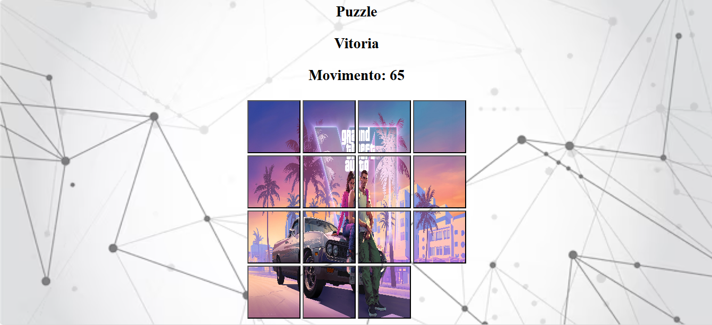

# **Puzzle Game - Quebra-Cabeça Deslizante**  

**🎮 Um jogo clássico de quebra-cabeça deslizante (15-puzzle) desenvolvido em HTML, CSS e JavaScript puro.**  



## **📝 Descrição**  
Este projeto é uma implementação do famoso **jogo de puzzle deslizante**, onde o objetivo é reorganizar as peças numeradas (1 a 15) em ordem crescente, movendo-as para o espaço vazio. O jogo inclui:  

✅ **Tabuleiro 4x4** com peças deslizantes  
✅ **Sistema de movimentos** contabilizados  
✅ **Imagem dividida** que se forma conforme o jogador avança  
✅ **Efeito sonoro** ao mover as peças  
✅ **Mensagem de vitória** quando o puzzle é resolvido  
✅ **Design responsivo** e simples  

## **🛠️ Tecnologias Utilizadas**  
- **HTML5** (Estrutura do jogo)  
- **CSS3** (Estilização e efeitos visuais)  
- **JavaScript** (Lógica do jogo, movimentação e vitória)  

## **🎯 Como Jogar**  
1. **Clique em uma peça adjacente ao espaço vazio** para movê-la.  
2. **Reorganize todas as peças** na ordem correta (1 a 15).  
3. **Complete o quebra-cabeça** para ver a imagem original se formar e receber a mensagem de vitória!  

## **🔧 Como Executar**  
1. Clone o repositório:  
   ```sh
   git clone https://github.com/EderJuniorS/Puzzle.git
   ```
2. Abra o arquivo `index.html` no seu navegador.  

## **📌 Melhorias Futuras**  
- [ ] Adicionar **diferentes níveis de dificuldade**  
- [ ] Implementar **contador de tempo**  
- [ ] Adicionar **mais imagens temáticas**  
- [ ] Tornar o jogo **totalmente responsivo** para mobile  

---

**🌟 Divirta-se jogando!**  
Se gostou do projeto, deixe uma ⭐ no repositório!  

🔗 **Link do GitHub:** [https://github.com/EderJuniorS/Puzzle](https://github.com/EderJuniorS/Puzzle)  

---

### **📜 Licença**  
Este projeto está sob a licença **MIT**. Sinta-se à vontade para usá-lo e modificá-lo!  
